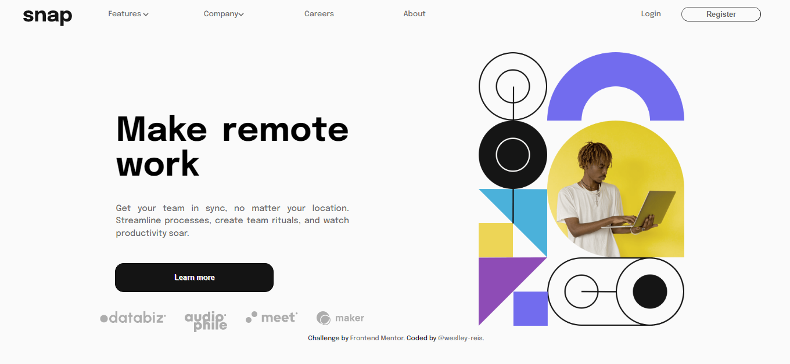

# Frontend Mentor - Intro section with dropdown navigation solution

Está é uma solução para o desafio [Intro section with dropdown navigation challenge on Frontend Mentor](https://www.frontendmentor.io/challenges/intro-section-with-dropdown-navigation-ryaPetHE5).

## Table of contents

- [Overview](#overview)
  - [O Desafio](#the-challenge)
  - [Screenshot](#screenshot)
  - [Links](#links)
- [Meu processo](#my-process)
  - [Construído com](#built-with)
  - [O que aprendi?](#what-i-learned)
  - [Desenvolvimento contínuo](#continued-development)
  - [Recursos Utilizados](#useful-resources)
- [Autor](#author)
- [Agradecimentos](#acknowledgments)

## Overview

### The challenge

Usuários devem ser capazes de:

- Visualizar menus dropdown tanto no desktop quando no mobile quando interagir com os links de navegação.
- Visualizar o layout ideal para o conteúdo, dependendo do tamanho de dela do dispositivo.
- Visualizar o status hover para os elementos interativos da dela.

### Screenshot

### Links

- Solution URL: [Repository](https://github.com/weslley-reis/intro-section-with-dropdown-navigation-main)
- Live Site URL: [GitHubPages](https://weslley-reis.github.io/intro-section-with-dropdown-navigation-main/)

## My process

### Built with

- Semantic HTML5 markup
- CSS custom properties
- Flexbox
- Mobile-first workflow
- Javascript

### What I learned

Depois de construir todo o projeto baseado em `position: absolute` e `position: relative`, iniciando pelo layout desktop e começar a ter sérios problemas para construir a versão mobile, comecei tudo do zero novamente.

Isso me deu a oportunidade de entender de fato a propriedade `position`, e perceber que ela não se adequava para o que eu buscava. Também aproveitei para entender as potencialidades do "Mobile-First" e reiniciei o projeto utilizando `flexbox`, conseguindo um resultado mais próximo do desafio e um código mais enxuto.

### Continued development

Aprofundar meus conhecimentos em `flexbox` e seus ajustes, pois apesar de utiliza-lo bem no projeto, me restam algumas duvidas sobre o tópico.

### Useful resources

- [Pare de chutar o css](https://www.youtube.com/watch?v=5PS6ku8NzIE&list=PLirko8T4cEmx5eBb1-9j6T6Gl4aBtZ_5x) - Essa playlist do [Marco Bruno](https://www.linkedin.com/in/marcobrunobr/) me ajudou a entender o `position` de uma vez por todas e perceber não se tratar da solução que eu buscava.

- [Maujor - Css Moderno Explica para Dinossauros](https://www.maujor.com/tutorial/css-moderno-explicado-para-dinossauros.php) - Esse artigo do [Maujor](https://www.linkedin.com/in/mauricio-maujor-800111a3/?original_referer=https%3A%2F%2Fwww%2Egoogle%2Ecom%2F&originalSubdomain=br) cobre toda a evolução dos posicionamentos CSS o que complementou o material anterior na opção por `flexbox` em detrimento do `position`;

- [CSS Button Generator](https://cssbuttongenerator.com/) - Plataforma que utilizei para auxílio da construção dos botões do layout.

## Author

- GitHub - [@weslley-reis](https://github.com/weslley-reis)
- Linkedin - [Weslley Reis](https://www.linkedin.com/in/weslley-reis-ba1ab6156/)

## Acknowledgments

Agradecimentos ao [Maujor](https://www.linkedin.com/in/mauricio-maujor-800111a3/?original_referer=https%3A%2F%2Fwww%2Egoogle%2Ecom%2F&originalSubdomain=br) e ao [Marco Bruno](https://www.linkedin.com/in/marcobrunobr/) pelo material gratuito disponibilizado que me auxiliaram muito no processo de construção do projeto.
